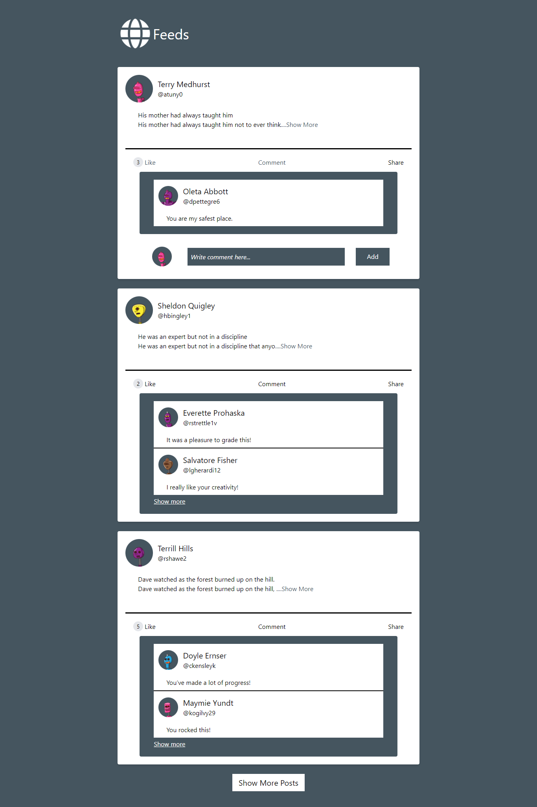
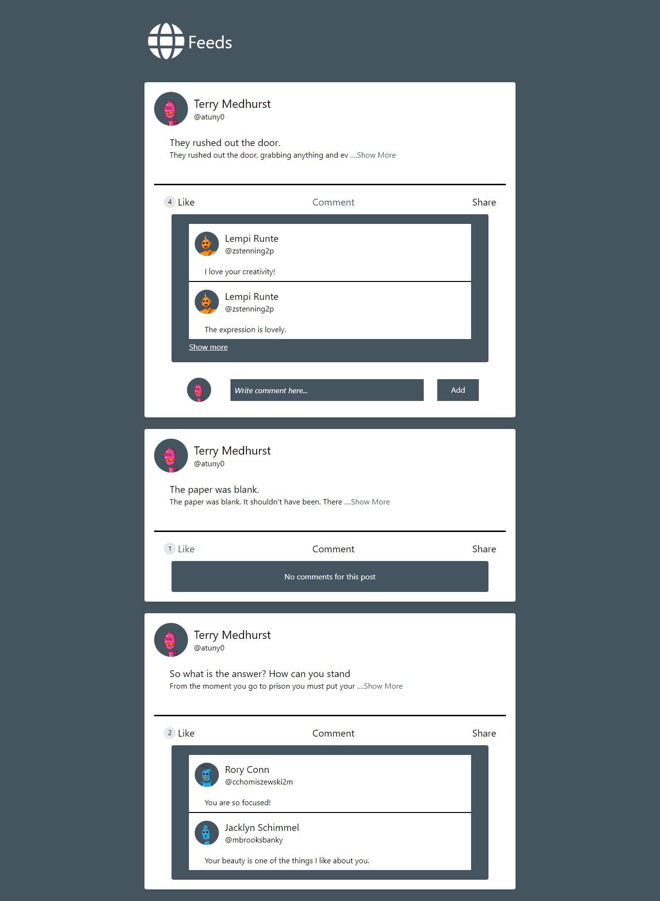
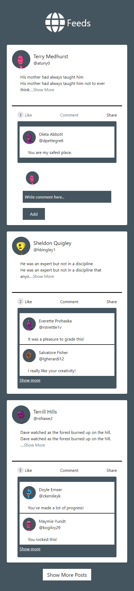

##### Table of Contents

[Links](#links)  
[Description](#description)  
[Tools](#tools)  
[Screenshots](#screenshots)  
[Setup](#setup)  
[Development](#development)  
[Production](#production)

# Links

- Live Site URL: https://chefaa-task.vercel.app/

# Description

This is a simple feed page built with Nuxt 3 & Vue 3.

Users Can:

- View the optimal layout for the App depending on their devices.
- Add new Comments & Reacts to a post.
- View a specific user posts page

# Tools

- HTML
- Tailwind CSS
- Vue 3
- Nuxt 3

# Screenshots

 


# Setup

Make sure to install the dependencies:

```bash
# yarn
yarn install

# npm
npm install

# pnpm
pnpm install
```

# Development

Start the development server on `http://localhost:3000`

```bash
npm run dev
```

# Production

Build the application for production:

```bash
npm run build
```
